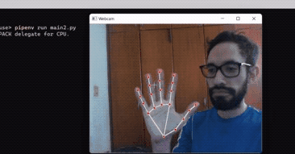

# This project is based on A.I. hands tracking with opencv, to control mouse

#### Install the python packages of Pipfile on virtual enviroment:
```
$ pipenv install
```
#### Start Virtual Enviroment:
```
$ pipenv shell
```
#### Run this project:
```
$ pipenv run main2.py
```
#### Example Image:

<!--  -->

## Note
You may have to change index of your webcam at main2.py